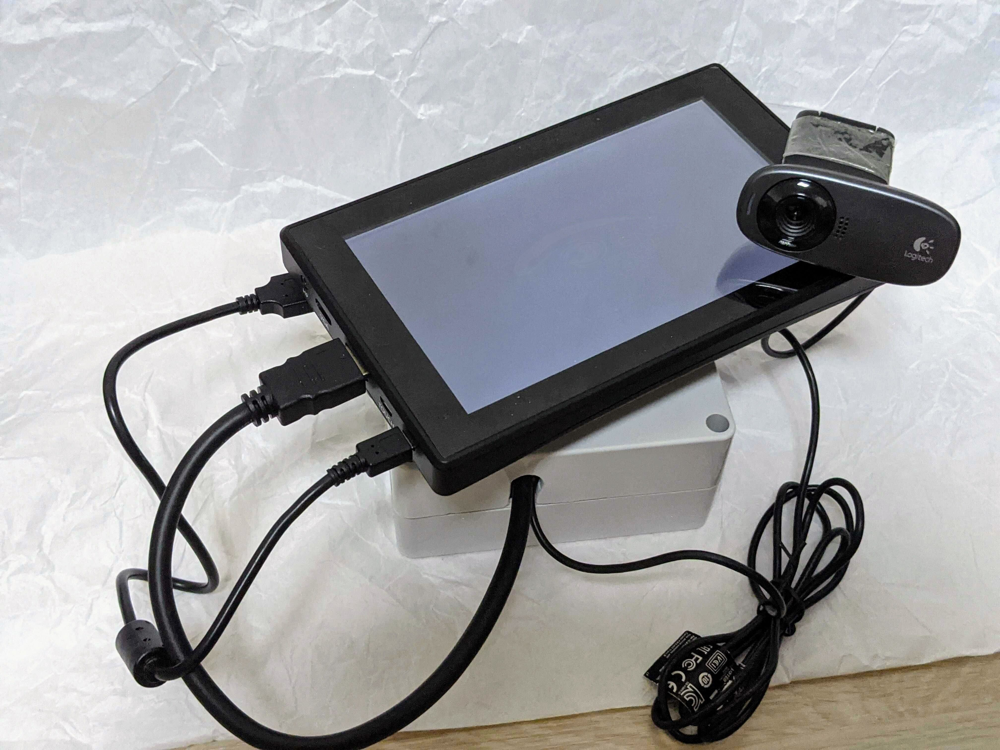

# License Plate Recognition System

Real-Time Multiple License Plates Recognition System


|  Device Look | Detect |
| --------  | -------- |
| |  |


## Requirements

* Ubuntu 18.04 
* CUDA 10.0 (10.2)
* CuDNN 7.x.x (8.x.x) 
* TensorRT 4.x.x
* PyTorch 1.3.1

## Quick Start

#### 1.Download weights
[YOLO](https://drive.google.com/file/d/1gu0GLj61jJlyYw0-wOGri30eCNC4-LxU/view?usp=sharing)
[CRNN](https://drive.google.com/file/d/1-JWLIcem6HYRIul8dyEiuBD2FSaGmPao/view?usp=sharing)
```bash
$ mkdir ./weights #put download weights here
```
----
#### 2.Build C++ TensorRT

```bash
$ cd license_plate_recognition_system
$ sudo chmod a+x ./scripts/build_tensorrt.sh
$ export TENSORRT_ROOT=<path_to_tensorrt_root> # x86_64 only
$ ./scripts/build_tensorrt.sh
```

#### Error

```bash
fatal error: NvInfer.h: No such file or directory

==> Tensorrt root is not found.
Modify tensorrt lib and include path on CMakeLists.txt
1. license_plate_recognition_system/recognize/tensorrt_c/CMakeLists_amd64.txt
2. license_plate_recognition_system/detect/tensorrt_c/CMakeLists_amd64.txt

```

----
#### 3.Run
```bash
# run demo from video
$ python demo_by_video.py

# run demo from webcam
$ python demo_by_webcam.py
```
